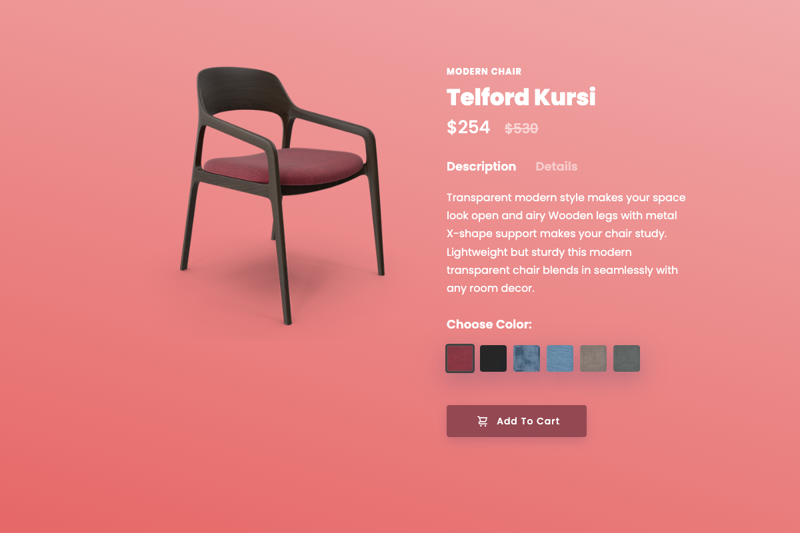

# 🪑 Modern Chair - Interactive Product Showcase

A visually stunning and interactive landing page for a modern chair (Telford Kursi), built purely with HTML and Advanced CSS. No JavaScript is used for the interactive elements!

## ✨ Features

- **Interactive Color Selection:** Change the chair's color and background seamlessly using CSS radio buttons.
- **Smooth Animations:** Features smooth transitions, shake animations when switching chair variations, and sliding background gradients.
- **No-JS Interactivity:** The entire interactive logic (tabs for description/details, color switching) is handled entirely using the CSS `:checked` pseudo-class and sibling combinators (`~`, `+`).
- **Responsive Design:** Ensures a great viewing experience across desktop, tablet, and mobile devices.
- **Modern UI:** Clean, minimalistic aesthetic with custom fonts (Poppins), drop shadows, and visually appealing gradients.

## 🛠️ Technologies Used

- **HTML5:** Semantic structure and form elements (radio inputs) used for state management.
- **CSS3:** Advanced techniques including:
  - Custom animations (`@keyframes`)
  - Transitions and Transforms
  - Flexbox for layout
  - Advanced selectors (`:checked`, sibling combinators)
  - Gradients and opacity toggling

## 🚀 Getting Started

To view this project locally:

1. Clone the repository or download the files.
2. Open `index.html` in your favorite modern web browser.
3. *That's it!* No build tools or servers required.

## 📸 Demo

Click on the different color swatches to see the chair change dynamically. You can also toggle between the "Description" and "Details" tabs below the price.

*(If you host this on GitHub Pages or Vercel, add the live link here!)*

## 🙏 Acknowledgements

Special thanks to **Code Help** and **Love Babbar** for the amazing explanation and tutorial that inspired this project and helped in understanding advanced CSS concepts.
